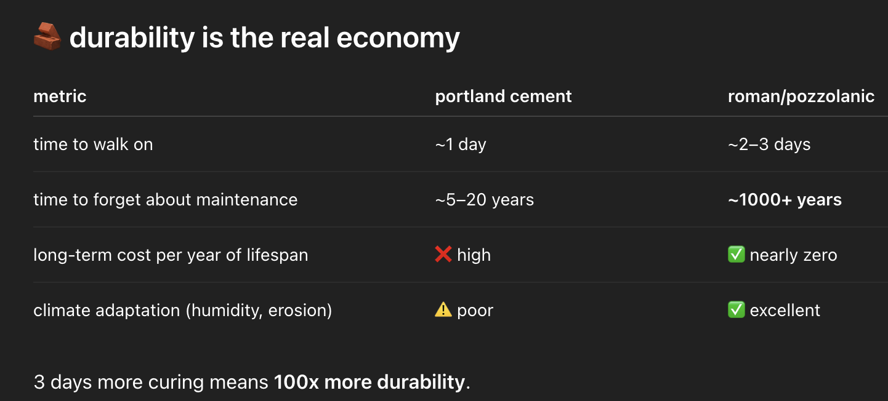

- recipe for high-durability pozzolanic concrete with aggregate inspired by [[roman concrete]]
- table: mix per 1 m³ compacted concrete
  | component              | bahasa name              | weight (kg) | volume (liters) | density (kg/m³) | function                          |
  |------------------------|---------------------------|-------------|------------------|------------------|------------------------------------|
  | [[crushed gravel]] | kerikil basalt campuran | ~800        | ~500             | ~1600           | structural aggregate                |
  | [[lime paste]]      | kapur sirih               | 130         | ~81              | ~1600           | primary binder                      |
  | [[volcanic ash]]           | abu vulkanik              | 200         | ~133             | ~1500           | pozzolanic reaction                 |
  | [[basalt powder]]   | bubuk basal halus         | 100         | ~67              | ~1500           | microfiller, structure              |
  | [[kaolin clay]]            | lempung kaolin            | 70          | ~47              | ~1500           | thermal stability                   |
  | [[wood ash]]          | abu kayu halus            | 40          | ~33              | ~1200           | secondary pozzolanic action         |
  | [[clean water]]            | air bersih                | 120         | 120              | 1000            | activation of reaction              |
  | [[rubber latex]] | getah karet alami       | 2–5% of liquid | included in water | ~920–980         | improves flexibility, crack resistance |
	- instructions
		- mix dry components thoroughly: volcanic ash, basalt powder, kaolin clay, wood ash
		- separately prepare lime paste
		- combine dry mix with lime paste
		- gradually add clean water while mixing
		- optionally replace 2–5% of water with getah karet
		- mix until thick sour cream consistency
		- add crushed gravel and mix thoroughly
		- pour in 10–15 cm lifts; compact using tamping or vibration
		- cover surface with wet cloth or mist for at least 10–14 days
	- summary
		- outstanding compaction is critical
		- final density after compaction: ~1900–2100 kg/m³
		- expected durability: 1000+ years in tropical open-air conditions
- 
- 
- 
- 
- 