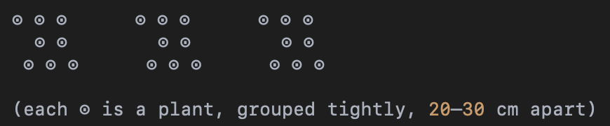

alias:: pakis sayur, vegy fern
tags:: species, genus, major, super

- [[high margin]] [[fern]] for [[biohacking]] if processed to powder
- {:height 648, :width 908}
- 
-
- perfect clump
	- height: 50–100 cm
	- diameter of clump: 40–80 cm, dense rhizome base with multiple crowns
	- number of fronds: 12–20 healthy fronds
	- 3–5 young curled fiddleheads ready for harvest
	- 5–7 mature functional fronds
- harvest
	- only the young fiddleheads at 10–20 cm length
	- max 2 fronds per harvest
- prune
	- leave at least 3-4 mature fronds per plant for photosynthesis and root health
	- remove brown/drying fronds to prevent pest/fungal buildup
	- frequency: every 15–20 days in rainy season, 30 days in dry season
- surrounding
	- avoid aggressive root competitors like ginger or taro
	- [[gotu kola]], [[lamtoro]], [[mentha]]
	- spacing plants 1 m apart to allow air flow
	- grows best in family clusters
	- plant-to-plant spacing inside a cluster: 20–30 cm apart center to center
	- cluster size: typically 3 to 5 plants per cluster
	- cluster diameter: about 60–80 cm total
	- between clusters: 1 meter
	- 
- yield max
	- biochar + shade + nitrogen-fixing + family clumping
	- can double production per square meter from ~0.2 kg/month to 0.4–0.5 kg/month