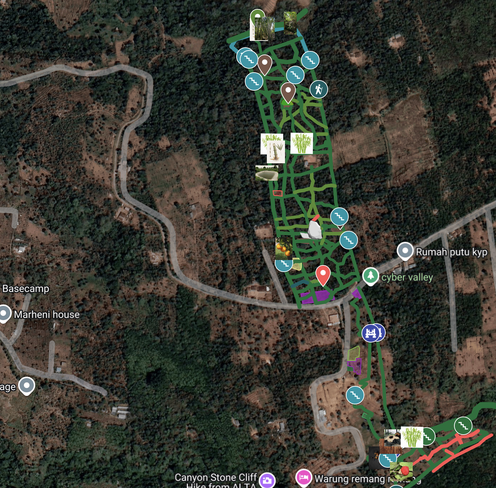

tags:: cve

- ## Why?
	- everyone have land, even 4 ares is the resource
	- almost everyone work on [[nandu]] terms with other landlords
	- region have systematic growing problems
		- cloves pruning
		- banana and avocado virus
		- low yield of coffee and avocado
		- toxic vegetables
		- low diversity of produce
	- need innovations in farming!
	- we are launching nandu grow: incubator for farming innovations
	- usual nandu: you are worker
		- you provide labor and investments
		- landlord take half
		- landlord can kick you of without any return
	- cyber nandu: you are steward
		- you provide labor and half of investments
		- landlord take half, but provide
			- cutting edge education
			- half of investments into tools, materials, seeds and seedlings
			- selling channels: [[organiq]], [[banya]], [[vitalik]], [[soft]], [[elons]], [[satoshi]]
				- and [[cyber market]] soon
			- access to [[laba]] for construction
			- [[good company]]
			- income security: 1M [[$IDR]] for 40 hours [[learn for pay]] monthly guaranted
			- donations from tourist
			- 5% from all cyber valley revenue proportionally to learn for pay
		- if landlord fire you or sell the land you get return of your initial investments
- ## Comparison
	- | aspect                      | usual nandu                                    | cyber nandu                                                                 |
	  |-----------------------------|-------------------------------------------------|------------------------------------------------------------------------------------------|
	  | labor                       | worker                        | steward                                                               |
	  | what to grow                   | [[plants]], [[animals]] | [[plants]], [[animals]], [[fungi]], [[insects]], [[aquatics]] |
	  | investments (tools, materials, seeds)  | by worker                                 | shared 50/50 between steward and landlord |
	  | landlord contribution     | only land                                       | land, deep support ecosystem                                   |
	  | education                   | none                                            | cutting-edge education and mentorship                                                   |
	  | sales access                | steward handles sales                           | access to curated channels (organiq, banya, vitalik, soft, elons, cybermarket upcoming) |
	  | physical resources          | steward's own tools                             | access to infrastructure (laba, shared tools, venues)                                   |
	  | ecosystem & community       | isolated                                        | strong peer group, cross-support, knowledge exchange                                    |
	  | income security             | none                                            | 1 million idr / month for 40 hours "learn for pay" guarantee / base is 25k per hour                              |
	  | social security fund        | none                                            | 10% of salary allocated to collective security fund                                     |
	  | additional benefits         | —                                               | direct donations from tourists                              |
	  | cyber valley revenue share  | none                                            | 5% of total cyber valley revenue distributed to stewards               |
	  | return of investments in case of land sale or firing | no | yes |
	- participants of the program have access to [[nandu guide]] and [[nandu manage]]
- ## Questions
	- how to choose the land?
		- current land available is the [[bridge]]
		- once bridge is established we will open access to other land
		- [[bridge]] is 7.5 ha of land
			- 5 ha never have been fertilized and have productive garden
			- 2.5 ha are likely was fertilized and does not have garden
		- 
	- can i work on the piece of land with the team?
		- yes, but you manage your team yourself
		- and take all the risks regarding the team
		- nandu program is a leadership program
		- so for one piece of land only one main leader can be assigned
	- what happens if the land is sold?
		- in such case you are loosing all your labor efforts as in the case with usual nandu
		- however in cyber nandu all accumulated investments are returned to a steward
		- e.g. you spend 10 mil for a pond or space for animals, they will be returned
		- after sale [[cve]] can offer other opportunities
	- what happens if i will be fired from [[cve]]?
		- it depends,
		- in some cases you can continue to work on your land
		- in some - you are loosing the access to the land
		- in any case all accumulated investments are returned to you, the steward
	- what happens if i plant long term crops but stewards of piece of land changed?
		- the general rules is that current stewards who make yield decide how to distribute earnings, including past stewards
		- all history of stewards is known
		- so if you plant [[santalum album]], but someone in the future cut it
		- these steward from the future can decide to honor you, the steward who plant it
		- that is how you can get return on your long term investments
		- its really hard to account for all the trees, so we rely more on thanksgiving culture
	- how to apply?
		- currently the program is only for workers of [[cve]]
		- later we will open the program for everyone
		- if you are a worker you have access to chat in telegram
		- go to [nandu grow](https://t.me/c/2245058785/16063) topic
		- the information to start is there
		- you can ask any question there
- ## [Join farming innovation](https://t.me/c/2245058785/16063)