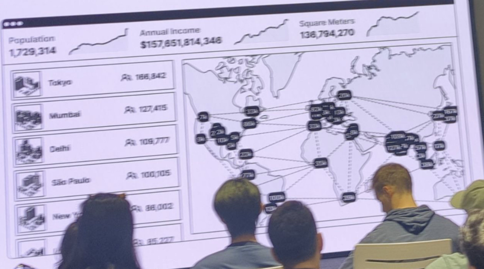
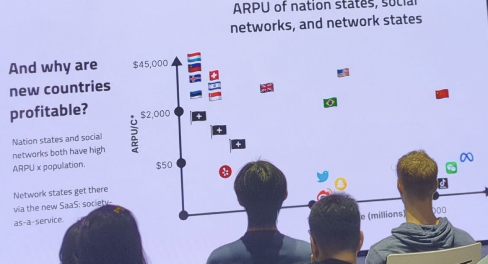
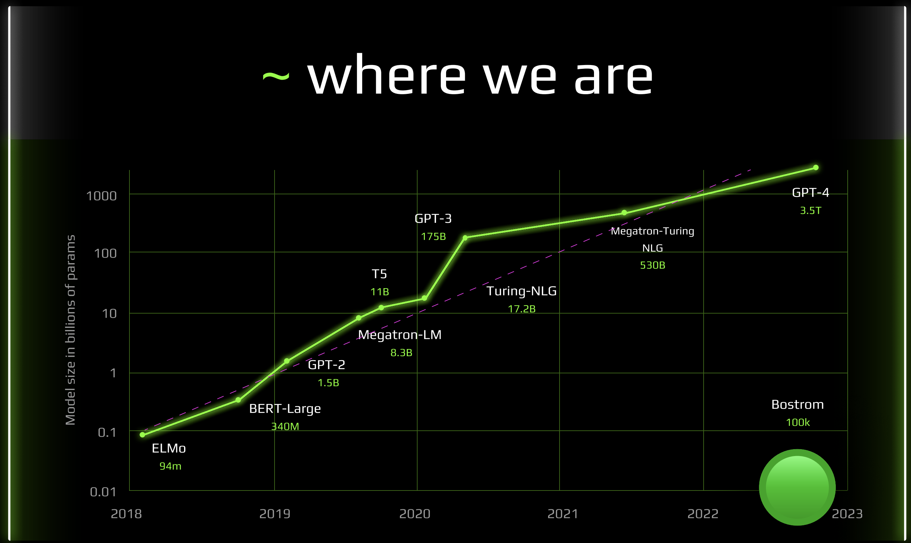

- talk on cyberacademy
- 2 cases
	- virtual: bostrom
	- real: cyber valley and citadel genesis
- thoughts on deai talk
	- bittensor: works
	- bostrom: works
	- cortex: not
	- gensyn: ideas looks cool, nothing to test yet
	- others are just services
- thoughts on network state conference
	- overall
		- critical mass is here
		- very far from reality: from real land and development
		- huan benet and aleph city looks like game changer
		- forest city is cool
	- vision
		- 
		- 
		- population
		- land size
		- revenue per citizen
		- cap per citizen
- [[bostrom]]
	- moon network state with superintelligence
	- https://cyber.page
	- https://cyb.ai/oracle/stats
	- [introduction to bostrom for ai geeks](https://cyber.page/#/page/introduction%20to%20bostrom%20for%20ai%20geeks)
	- where superintelligence come from?
		- 
		- now is 3 mln cyberlinks
		- exponential acceleration of cybergraph grow already in place
	- applications
		- public storage and distribution
		- collaborative labeling
		- personal finetuning
- [[cyber valley]]
	- [[citadel genesis]]
	- [[bootcamp/v0]]
	- [[game of freedom]]