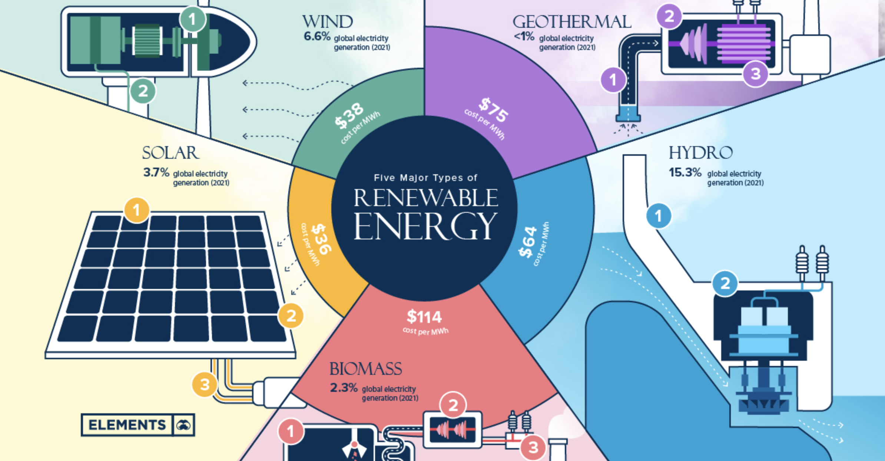

icon:: ⚡️

- 
- 
- energies
	- sun
		- according to kardashev scale
		- solar is the key
		- current [[citadel genesis]] status
			- 30 kw of solar generation which cant be reliable in our environment
			- 30 kw of energy storage which is convenient for us
	- water
		- [[hydrogen]] and [[oxygen]] power in water
		- hydro aka graivty based
		- ocean tidal and temperature based
		- current [[citadel genesis]] status
			-
	- air
		- low altitude winds
		- high altitude winds
		- elements in the air: [[oxygen]], [[nitrogen]], [[carbon]], [[argon]]
		- current [[citadel genesis]] status
			- TODO diversification with wind turbines
	- earth:
		- topsoil geothermal
		- mild geothermal
		- deep geothermal
	- life:
- alternative != sustainable
- sustainable is when energy system can run indefenetly
	- | aspect |	solar panel	| lithium battery 	| computer chip  |
	  |---------|------|--------|---------|
	  | lifetime	| 10–30	| 3–15	| 10-30 |
- rough estimation of production complexity for staple energy system
	- | aspect |	solar panel 	| lithium battery	| computer chip |
	  |---------|------|--------|---------|
	  | number of countries	| 10–15	| 8–12	| 10–12 |
	  | number of companies |	100–200	| 50–150	| 150–300 |
	  | number of people involved | 500,000 to 1 million |	250,000 to 500,000 |	1 million to 1.5 million |
- two questions
	- how to bootstrap the system using still working supply chains?
	- how to design less complex, but more efficient energy system?
- came into two phases
	- 1 fast phase: buy staple energy system
	- 2 slow phase: during lifetime replace with sustainable
		- cheap storage as heat in water, soil, sand or whatever
		- stirling engine is needed
		- components
			- at least 3 sources
				- solar heat collectors
				- 2 chamber stove
				- medium altitude kites
			- water and soil heat batteries
			- sterling engine
- basalt road as heat collector, basalt cistern and surrounding soil as heat storage
	- 1 m2 of basalt road can charge 1 m3 of water in cistern over a 90-day dry season
	- double the road area, you halve the charging time
	- heat loss from the un-insulated cistern to surrounding soil is < 3 % per month at 2 m burial depth
	- that lost heat simply diffuses into the soil store and is not wasted
	- overall system cost is dominated by tubing and electrics pumps
	- all other materials are site stone, soil and manual labour